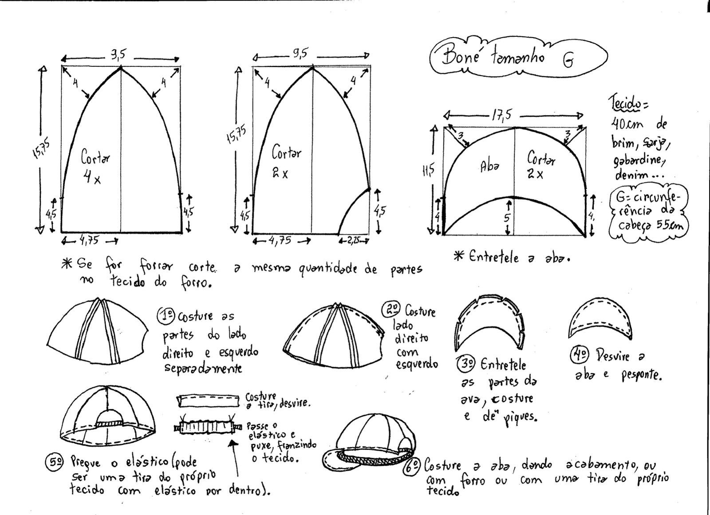

# CFA

ACH2157 - Computação Física e Aplicações (2024)

# Projeto Solar Cap

## Design do Boné

## Mapemento dos Pinos

### Sensor UV (GYML8511)

VIN <-> nada\
3V3 <-> 3V3\
GND <-> GND\
OUT <-> D34\
EN <-> 3V3

### Sensor de Luz - LDR

5Vcc <-> 3V3\
Sinal Analog. <-> D32\
GND <-> GND\
Led1 <-> D13\
Led2 <-> D12\
Led3 <-> D14

### Motor de Vibração Coin

Fio Vermelho <-> D5\
Fio Preto <-> GND

### Sensor touch - TTP223B
IO <-> D18\
VCC <-> 3V3\
GND <-> GND
